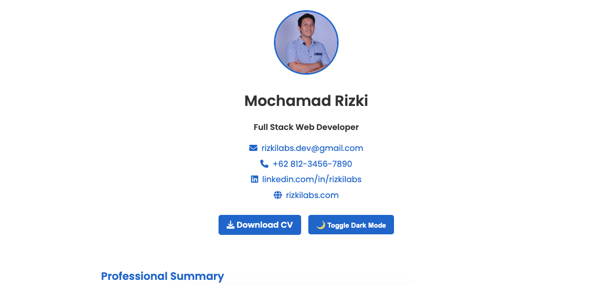

# 📄 Mochamad Rizki – HTML CV

Live Demo: [https://rizkilabs.github.io/single-page-cv/](https://rizkilabs.github.io/single-page-cv/)

A clean, responsive single-page **HTML CV** to showcase the career history, skills, and contact information of a Full Stack Web Developer. Easily customizable and printable, with support for dark mode, PDF download, and sharing on social platforms.

---

## ✨ Features

- Semantic HTML5 structure for accessibility
- Responsive design with Flexbox and media queries
- Google Fonts (Poppins) for clean typography
- Font Awesome icons for enhanced UI
- Profile photo and downloadable PDF CV
- Dark mode toggle (JavaScript + CSS)
- Optimized for printing
- SEO and Open Graph meta tags for better sharing

---

## 📷 Screenshot



---

## 🚀 How to Use

### Option 1: Open Directly

1. Clone or download this repo:
   ```bash
   git clone https://github.com/yourusername/single-page-cv.git

2. Open `index.html` in your browser.

### Option 2: Deploy to GitHub Pages

1. Push the project to a GitHub repository
2. Go to **Settings > Pages**
3. Choose the `main` branch and root folder
4. Visit: `https://yourusername.github.io/single-page-cv/`

---

## 📁 Folder Structure

```
html-cv/
├── index.html              # Main CV file
├── profile.jpg          # Profile image
├── cv.pdf               # Downloadable version
├── screenshot.png       # (Optional) Screenshot for README
└── README.md            # This file
```

---

## 🛠️ Technologies Used

* HTML5
* CSS3
* JavaScript (for dark mode)
* Google Fonts – [Poppins](https://fonts.google.com/specimen/Poppins)
* Font Awesome 6 (CDN)
* GitHub Pages (for deployment)

---

## 👨‍💻 Author

**Mochamad Rizki**<br>
Full Stack Web Developer<br>
🌐 Website: [rizkilabs.com](https://rizkilabs.com)<br>
📧 Email: [rizkilabs.dev@gmail.com](mailto:rizkilabs.dev@gmail.com)<br>
🔗 LinkedIn: [linkedin.com/in/rizkilabs](https://linkedin.com/in/rizkilabs)

---

## 📝 License

This project is licensed under the [MIT License](LICENSE).

```
